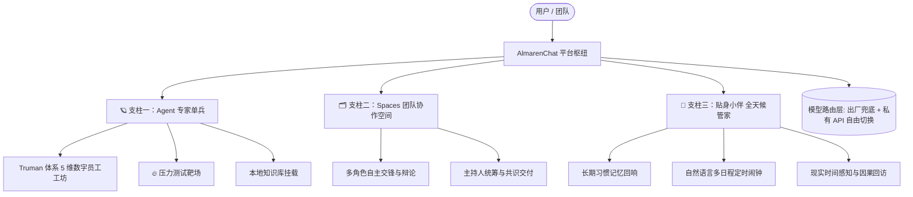
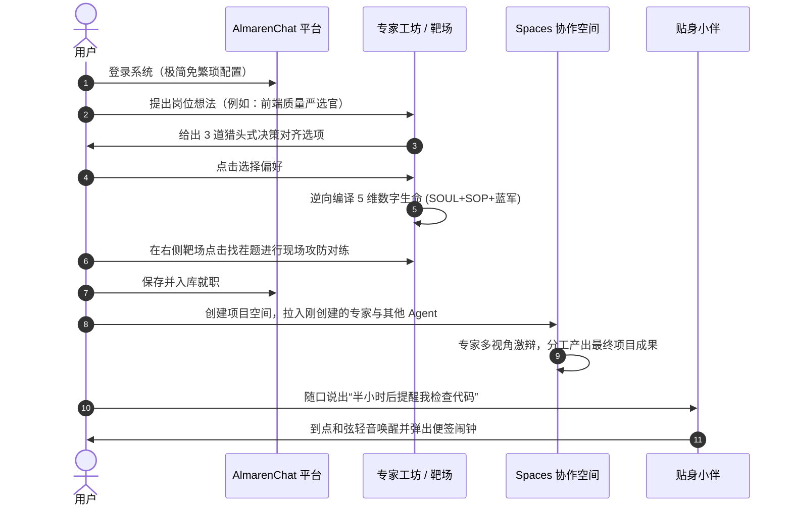

# AlmarenChat（阿玛伦智能协作平台）产品说明文档

> **版本**：v2.0  
> **定位**：面向知识工作者与协作团队的新一代「单兵专家 × 群体协同 × 贴身管家」智能体协作平台  
> **核心主张**：*让单聊更深入，让多智能体协同为你所用，让日常陪伴知冷知热。*

---

## 一、 产品概述与愿景

**AlmarenChat（阿玛伦）** 不是一个简单的套壳聊天机器人，而是一个**企业级/个人级一体化 AI 智能体生态协同平台**。

在传统 AI 对话工具中，模型往往扮演着“千篇一律、过度讨好、缺乏定力”的廉价客服角色。AlmarenChat 从底层重塑了人机与机机协作模式，构建了 **「单兵专家（Agent）」**、**「团队协同（Spaces）」** 与 **「全天候贴身管家（个人助理）」** 三位一体的产品矩阵，帮助用户把模糊的直觉转化为具备工业级交付标准的专业产出。

---

## 二、 平台三大核心支柱

### 1. 🪐 支柱一：Agent 单兵与数字员工工坊（从玩具到专业级生产力）
平台提供业内领先的**双模式 Agent 创建与治理体系**，彻底打破“调教 AI 靠随手敲几句玄学 Prompt”的困局：

- **⚡ 快捷基础版**：
  - 面向轻度娱乐、日常灵感问答；
  - 30 秒快速配置头像、基调标签、开场白与简单指令，开箱即聊。
- **👔 专家数字员工版（Truman 工业级生命体系）**：
  - 引入 OpenClaw 工业级智能体建模理论，将模糊需求逆向编译为**高对抗度、高可靠性的五维数字生命**：
    1. **AI 猎头式 3 问对齐**：输入一句话职责或粘贴标杆范文，系统逆向提炼岗位最具分歧的 3 个决策点，一键点选定调；
    2. **🛡️ 灵魂宪法 (SOUL)**：注入核心定力与**去表演化纪律**，彻底剔除“好的、很高兴为您服务”等无意义客套，强制直奔交付；
    3. **⚔️ 蓝军反驳协议**：赋予 AI **敢于对用户说不**的权力，明确在特定业务地雷或缺少输入时触发【REJECT / 打回】机制并给出行之有效的整改方案；
    4. **📋 交付 SOP 规程**：规范推进工序，严格对照 **Definition of Done (DoD) 自检清单** 逐项过关，杜绝粗制滥造；
    5. **🚫 红线禁区**：划定绝对禁止越权、禁止盲猜造假的安全底线；
    6. **🔥 压力测试靶场（Stress Test Arena）**：在正式就职前，系统逆向生成 3 道刁钻挑刺考题，现场在右侧对练靶场实时验货抗辩，满意后再入库就职。
- **挂载向量知识库（RAG）**：
  - 支持为任意 Agent 绑定专属私有知识库文件，实现高精度的上下文补充与事实检索。

---

### 2. 🗂️ 支柱二：多智能体协作空间（Spaces）
单个 Agent 能力再强也存在认知盲区，**Spaces 是多 Agent 并肩作战、互补碰撞的虚拟作战室**：

- **打破单机器人边界**：在同一个空间内引入多个不同角色的专家（例如：*产品经理、资深架构师、安全合规官、数据分析师*）；
- **多元视角激烈交锋**：支持针对复杂方案让各专家展开交叉质询与红蓝对抗，在讨论中暴露隐藏技术漏洞或业务硬伤；
- **主持人模式与任务推进**：支持指定 Host Agent 统筹全场节奏，自动拆解子任务分发给对应领域的专家，并将讨论成果凝练为结构化的最终交付物。

---

### 3. 🌿 支柱三：贴身小伴（懂你的全天候生活与工作管家）
常驻于系统右下角、跨页面随身召唤的贴心助手，兼具高情商陪伴与严谨的日程统筹：

- **知根知底的长期记忆库（Long-term Memory）**：
  - 能够在对话中自动捕捉用户的生活作息、饮食偏好、工作习惯，并支持用户在个人中心自由管理、停用或一键抹除；
- **自然语言随手记与复合日程拆解（Smart Reminders）**：
  - 随口说出“*我 16:30 喝水，17:00 开会，18:00 下班*”，秒级拆解为多条独立定时闹钟并挂载到顶部便签；
  - 到点通过 Web Audio API 播放大调和弦清音，轻柔微光弹窗唤醒，支持“延后 10 分钟”与“完成”打勾动效；
- **现实时间感知与真实因果回访（Causal Follow-up）**：
  - 告别机械式的定点打卡灌鸡汤。小伴感知真实北京时间，并在用户聊到汇报、面试、就医等重大事件后，在合理时间窗口（如 1 小时后）发起**知冷知热的单次因果回访**（*“刚才跟王总的重构汇报还顺利吗？忙完了先喝口水呀☕”*）；
- **全站超级领航员**：
  - 精通平台所有功能与配置方法，当用户询问如何换模型、如何搭空间时，秒级给出点击直达的操作链接与简明指引。

---

## 三、 关键架构与核心技术亮点

| 特色亮点 | 解决的传统痛点 | AlmarenChat 的落地方案 |
| :--- | :--- | :--- |
| **反表演性与蓝军反驳** | 传统 AI 顺从谄媚、谎报军情，提错需求也盲目附和 | 编译进 Prompt 核心的蓝军反驳协议，遇陷阱强制打回 |
| **多维解耦与逆向反解** | 复杂 Agent 修改时提示词揉成一团，无法精修特定规则 | 5 维独立编辑器，保存与编辑态双向无损逆向解析 |
| **现场压力测试靶场** | Agent 设完后不知道实战好不好用，需要到处建会话试错 | 在创建页面右侧集成流式演练靶场，一键发起攻防测试 |
| **因果关怀与允许沉默** | 机器人动辄机械弹窗打扰用户正常工作 | 基于可见性与因果窗口检测，无事绝对安静（NO_REPLY） |
| **自由模型路由体系** | 依赖单一厂商接口，遇到限流或网络波动容易停摆 | 支持系统出厂模型兜底，同时支持个人自定义 OpenAI 协议私有模型 |

---

## 四、 核心使用流程（用户旅程）

---

## 五、 适用群体与典型场景

1. **研发与工程团队**：
   - 创建严苛的代码 Reviewer、架构设计评估专家、SQL 审查员，杜绝带着技术债务上线；
2. **产品与商业策略团队**：
   - 在 Spaces 空间中组建“虚拟评审委员会”，模拟极端用户质询、商业可行性论证与竞品对抗分析；
3. **内容创作与自媒体**：
   - 打造具备专属文风与审美标准的写作智囊，严格按照前置大纲、正文打磨与发布清单自检交付；
4. **个人效率与生活成长者**：
   - 贴身小伴随行记录思考灵感，长期偏好自动沉淀，日程待办准点轻柔提醒。

---

## 六、 总结

**AlmarenChat（阿玛伦）** 的初心不是创造又一个“陪聊工具”，而是致力于**让 AI 成为具备专业骨气、严守交付纪律的数字员工**，并让多个专家在你的指挥下协同成军。
无论是一个人的深度思考，还是一个团队的复杂交付，AlmarenChat 都能为你提供坚实、可靠、有温度的智能体协作底座。
